# ClearSy, la méthode B et Event-B — guide de préparation

> **Pour :** Zakaria Teffah (ingénieur R&D, 14 ans : compilateurs FPGA, SMT, ROBDD, TLA+, Lean 4, SymbiYosys)
> **Objectif :** comprendre l'offre ClearSy, maîtriser les bases de B et d'Event-B, et savoir
> relier précisément ce que tu sais déjà (TLA+, Lean 4, SymbiYosys, compilation) à leur monde.
> **Date :** octobre 2026.

**Note sur les sources.** Le proxy de cet environnement bloquait `clearsy.com` et `zakaria-teffah.com`.
Les informations sur ClearSy viennent donc de recherches web : pages ClearSy indexées, articles de
Thierry Lecomte et al. sur arXiv, ABZ et FMICS (voir la [§9](#9-sources)). Ton profil vient du CV que tu m'as
transmis. Les affirmations que je n'ai pas pu vérifier sont signalées par **(à vérifier)**.
Les exemples **Lean** et **SymbiYosys** ont été **exécutés** (Lean 4.29.0-rc1, Yosys/SBY + Z3), et
leurs sources sont dans [`clearsy-exemples/`](clearsy-exemples/). Les exemples B et Event-B n'ont **pas** pu
passer dans Atelier B ou Rodin, qui ne sont pas installés ici. Je les ai relus à la main.

---

## Sommaire

1. [ClearSy en bref](#1-clearsy-en-bref)
2. [La méthode B (« B classique »)](#2-la-méthode-b--b-classique-)
3. [Atelier B en pratique](#3-atelier-b-en-pratique)
4. [Event-B](#4-event-b)
5. [La CLEARSY Safety Platform (CSSP)](#5-la-clearsy-safety-platform-cssp)
6. [Le pont avec ton expérience](#6-le-pont-avec-ton-expérience)
7. [Regard critique : limites et lacunes](#7-regard-critique--limites-et-lacunes)
8. [Préparation à l'entretien](#8-préparation-à-lentretien)
9. [Sources](#9-sources)

---

## 1. ClearSy en bref

| Élément | Ce que l'on sait |
|---|---|
| Création | 1er janvier 2001, par les ingénieurs qui avaient industrialisé **Atelier B** (outil issu de la chaîne interne d'Alstom et de Météor) |
| Statut | PME française indépendante, environ 140 personnes (surtout des ingénieurs et des docteurs) selon sa brochure 2020. L'effectif actuel est **(à vérifier)** |
| Implantations | Aix-en-Provence (siège), Paris, Lyon, Strasbourg |
| Figure technique | **Thierry Lecomte** (R&D) : auteur de la plupart des articles sur Atelier B, la CSSP et « 25 ans de B en industrie » |
| Cœur de métier | Les **systèmes critiques prouvés**, surtout ferroviaires (SIL4), mais aussi l'automobile, le spatial, le nucléaire et l'industrie |

### Carte de l'offre

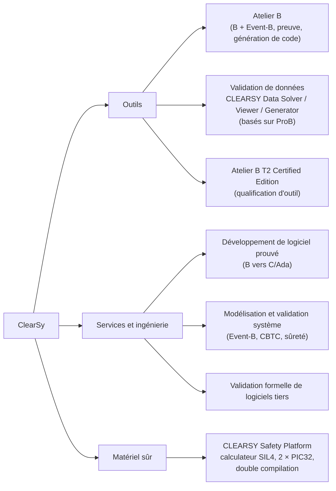

### Projets de référence (à citer en entretien)

| Année | Projet | Ce qui a été fait en B |
|---|---|---|
| 1998-1999 | **Météor**, ligne 14 du métro de Paris, sans conducteur (Matra / Siemens, RATP) | Logiciel de sécurité développé en B puis traduit en Ada. Chiffres souvent cités (Behm et al., FM'99) : environ 115 000 lignes de B, 86 000 lignes d'Ada générées, environ 28 000 obligations de preuve, et aucun bug trouvé après les tests unitaires |
| 2000-2010 | Les CBTC d'Alstom et de Siemens (dans le monde entier), les portes palières, etc. | B logiciel, génération de code |
| ~2010 | **NYCT Line 7 (Flushing)**, New York | Modèles Event-B des mouvements de trains, des aiguillages et du contrôle de vitesse, pour vérifier les exigences de sûreté d'un CBTC |
| ~2010 | **Octys** (CBTC de la RATP) | Validation Event-B des objectifs de sûreté : pas de collision, pas de déraillement sur un aiguillage non contrôlé, pas de survitesse |
| 2014+ | **DTVT** pour l'Urbalis 400 d'Alstom (Mexico, Toronto, São Paulo, Panama), **OLAF** pour l'ETCS de la SNCF | Validation formelle de **données** de paramétrage (plans de voie, tables) avec ProB |
| 2015+ | **CSSP** (projet LCHIP) | Calculateur SIL4 générique programmé en B |

> **Point clé pour l'entretien.** ClearSy ne vend pas seulement un outil. Elle vend surtout de
> l'**ingénierie** (des projets clients) dont la méthode B est le différenciateur. Une bonne partie
> des postes est donc orientée projet : modéliser, prouver, valider pour un client ferroviaire.
> Les postes purement R&D outils (prouveurs, générateurs de code, CSSP) sont moins nombreux.
> Ce sont aussi ceux qui collent le mieux à ton profil de compilateur.

---

## 2. La méthode B (« B classique »)

Conçue par **Jean-Raymond Abrial** (*The B-Book*, 1996), après Z. Son idée centrale est la suivante :

> On écrit une **spécification abstraite** (une machine), puis on la **raffine** pas à pas jusqu'à
> une **implémentation** assez concrète pour être traduite automatiquement en C ou Ada.
> **Chaque** étape engendre des **obligations de preuve (PO)**. Quand toutes sont prouvées, le code
> est correct *par construction* vis-à-vis de la spécification.

### 2.1 La chaîne de développement

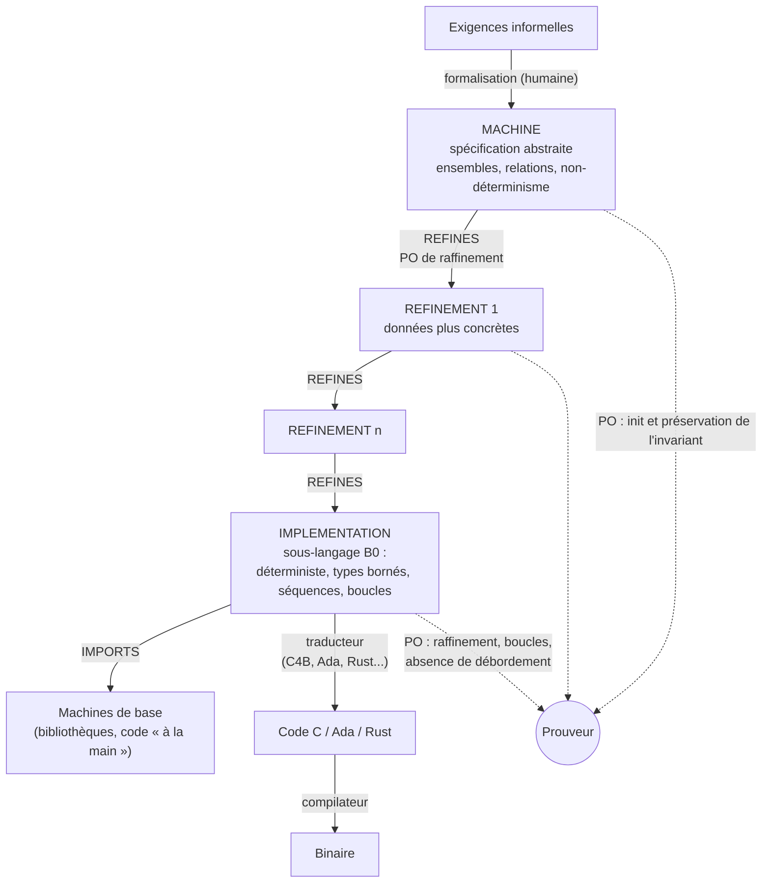

La **validation** (« est-ce la bonne spécification ? ») reste un travail humain : relecture, animation
avec ProB. La **vérification** (« le code est-il conforme à la spécification ? ») est assurée par la preuve.
Le traducteur et le compilateur restent des maillons à justifier. C'est précisément le rôle de la
double compilation de la CSSP (voir la [§5](#5-la-clearsy-safety-platform-cssp)).

### 2.2 Anatomie d'une machine — exemple fil rouge : la porte d'un train

```b
MACHINE
    Porte
SETS
    ETAT_PORTE = {ouverte, fermee}
CONCRETE_CONSTANTS
    VMAX
PROPERTIES
    VMAX : NAT1 & VMAX = 100
CONCRETE_VARIABLES
    porte, vitesse
INVARIANT
    porte : ETAT_PORTE &
    vitesse : 0..VMAX &
    (vitesse > 0 => porte = fermee)          /* exigence de sécurité */
INITIALISATION
    porte := fermee || vitesse := 0
OPERATIONS
    ouvrir =
        PRE vitesse = 0 THEN
            porte := ouverte
        END;

    fermer =
        BEGIN porte := fermee END;

    accelerer(dv) =
        PRE dv : NAT1 & porte = fermee & vitesse + dv <= VMAX THEN
            vitesse := vitesse + dv
        END;

    freiner(dv) =
        PRE dv : NAT1 & dv <= vitesse THEN
            vitesse := vitesse - dv
        END;

    rr <-- est_arrete =
        BEGIN rr := bool(vitesse = 0) END
END
```

Les clauses à connaître : `SETS` (ensembles abstraits ou énumérés), `CONSTANTS` et `PROPERTIES`
(constantes et axiomes), `VARIABLES` et `INVARIANT` (l'état et sa propriété), `INITIALISATION`,
`OPERATIONS`. Pour la modularité : `SEES`, `INCLUDES`, `IMPORTS`, `EXTENDS`, `PROMOTES`.

Le **typage** se fait par appartenance ensembliste (`vitesse : 0..VMAX`) : la théorie est une
**théorie des ensembles typée**, avec la logique du premier ordre, les relations, les fonctions
(`+->` partielle, `-->` totale, `>->` injective...), les séquences, `card`, `dom`, `ran`, `<|`, `|>`,
`<+` (surcharge), etc.

### 2.3 Les substitutions généralisées et la plus faible précondition

Les opérations ne sont pas des affectations impératives. Ce sont des **substitutions généralisées**,
dont la sémantique est donnée par la **plus faible précondition** `[S]R` (au sens de Dijkstra) :

| Substitution | Syntaxe B | `[S]R` | Intuition |
|---|---|---|---|
| Affectation | `x := E` | `R[E/x]` | substitution textuelle |
| Neutre | `skip` | `R` | |
| Précondition | `PRE P THEN S END` | `P ∧ [S]R` | c'est **l'appelant** qui doit garantir `P` |
| Garde | `SELECT G THEN S END` | `G ⇒ [S]R` | `S` est **inexécutable** si `G` est faux |
| Choix borné | `CHOICE S1 OR S2 END` | `[S1]R ∧ [S2]R` | non-déterminisme démoniaque |
| Choix non borné | `ANY z WHERE P THEN S END` | `∀z·(P ⇒ [S]R)` | |
| Parallèle | `S1 \|\| S2` | sur des variables disjointes | affectations simultanées |
| Séquence (raffinements, B0) | `S1 ; S2` | `[S1][S2]R` | |

> **Piège classique en entretien : `PRE` n'est pas une garde.**
> En B classique, `PRE` est un *contrat* : si l'opération est appelée hors de sa précondition, son
> comportement est **non spécifié** (elle peut faire n'importe quoi, c'est `abort`). La preuve que
> l'appel respecte `PRE` est déplacée vers **l'appelant**, via `IMPORTS`.
> En **TLA+** et en **Event-B**, la condition d'une action ou d'un événement est une **garde** :
> hors de la garde, l'action **ne peut pas se produire**. C'est le cas du `SELECT` de B.
> B classique est un langage de **composants logiciels** appelés par un environnement.
> Event-B et TLA+ décrivent des **systèmes réactifs** qui évoluent d'eux-mêmes.

### 2.4 Les obligations de preuve

Pour une machine d'invariant `I`, de propriétés `P` et d'initialisation `Init` :

- **PO d'initialisation :** `P ⇒ [Init] I`
- **PO de préservation**, pour chaque opération `PRE Q THEN S END` : `P ∧ I ∧ Q ⇒ [S] I`

Pour `ouvrir` sur l'exemple, on obtient, après calcul de `[porte := ouverte] I` :

```
I ∧ vitesse = 0  ⇒  ouverte : ETAT_PORTE ∧ vitesse : 0..VMAX ∧ (vitesse > 0 ⇒ ouverte = fermee)
```

Elle est prouvable, puisque `vitesse = 0` rend l'implication vide.
**Retire `PRE vitesse = 0`** : la dernière conjonction devient `vitesse > 0 ⇒ ouverte = fermee`. C'est faux
(`ouverte ≠ fermee`) dès que `vitesse > 0`. La PO est **improuvable**, et le défaut est trouvé *avant
d'écrire une ligne de code*. C'est exactement ce que fait le fichier Lean de la [§6.2](#62-lean-4--le-prouveur-de-b).

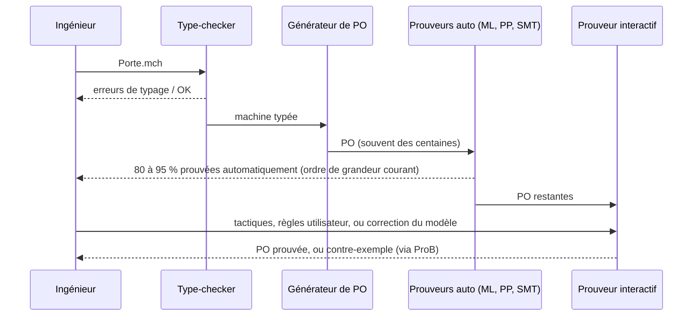

### 2.5 Le raffinement

Un `REFINEMENT` remplace les variables abstraites `a` par des variables concrètes `c`, reliées
par un **invariant de collage** `J(a, c)`. Pour chaque opération `PRE Q THEN S END`, raffinée par `S'` :

```
I ∧ J ∧ Q  ⇒  [S'] ¬[S] ¬J
```

Lecture : *pour tout pas concret `S'`, il **existe** un pas abstrait `S` qui rétablit le collage `J`*.
`¬[S]¬J` est la précondition conjuguée, qui exprime « S **peut** atteindre J ». Le raffinement peut
**réduire le non-déterminisme** et **affaiblir la précondition**, jamais l'inverse. C'est la
simulation (en avant) des sémanticiens.

### 2.6 L'implémentation et le sous-langage B0

Le dernier raffinement est une `IMPLEMENTATION`, écrite en **B0** :

- seulement des variables **concrètes**, et des types bornés implémentables (entiers machine, `BOOL`, énumérés, tableaux) ;
- **pas** de `||`, de `ANY` ni de `CHOICE` : uniquement `;`, `IF`, `CASE`, `VAR`, `WHILE` et les appels d'opérations importées ;
- chaque `WHILE` porte un **`INVARIANT`** et un **`VARIANT`**, d'où des PO de correction partielle et de terminaison ;
- les PO prouvent aussi l'**absence de débordement** sur les entiers machine.

```b
IMPLEMENTATION Somme_i
REFINES Somme                 /* Somme : rr <-- somme(nn) = PRE nn : 0..1000 THEN rr := nn*(nn+1)/2 END */
OPERATIONS
    rr <-- somme(nn) =
    VAR ii IN
        ii := 0; rr := 0;
        WHILE ii < nn DO
            ii := ii + 1;
            rr := rr + ii
        INVARIANT
            ii : 0..nn & rr = ii * (ii + 1) / 2
        VARIANT
            nn - ii
        END
    END
END
```

C'est l'exact analogue d'une preuve Lean par récurrence avec `termination_by`/`decreasing_by`,
ou d'un invariant de boucle Dafny ou Frama-C.

---

## 3. Atelier B en pratique

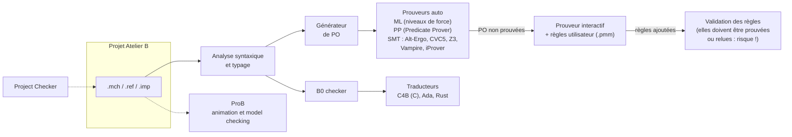

| Composant | À retenir |
|---|---|
| **Éditions** | *Community Edition* gratuite et complète (ex. 24.04.2, Linux, Windows, macOS ARM et x86) ; *Professional* ; **T2 Certified Edition** (outil de vérification qualifié au sens EN 50128 / EN 50716) ; édition éducative liée à la CSSP |
| **Prouveurs** | Prouveur maison historique (« ML », avec des niveaux de *force*) et **PP** (Predicate Prover) ; plus récemment, des **solveurs externes** : Alt-Ergo, CVC4/5, Z3, Vampire, iProver |
| **Règles utilisateur** | Ajoutées pour débloquer une PO. Une règle fausse rend tout prouvable, d'où leur vérification séparée. C'est un **point sensible pour la certification** |
| **Code** | C4B (C), Ada, et désormais **Rust** |
| **Event-B** | Atelier B gère aussi Event-B (comme Rodin) |
| **ProB** | Développé à Düsseldorf (Michael Leuschel), partenaire historique : animation, model checking explicite, contraintes ; c'est le moteur de la validation de données |

**Rodin** (Eclipse, open source, projets européens RODIN puis DEPLOY) est l'IDE de référence pour
**Event-B** dans le monde académique. Il a des plugins pour ProB, les solveurs SMT et les prouveurs
d'Atelier B. Atelier B est l'outil **industriel** et **qualifiable** de ClearSy pour B (logiciel) et Event-B.

---

## 4. Event-B

Event-B, aussi d'Abrial (*Modeling in Event-B*, 2010), est **une simplification de B pour modéliser
des systèmes** et non plus seulement des logiciels : un train, un réseau, un protocole, avec son
environnement.

### 4.1 Contextes et machines

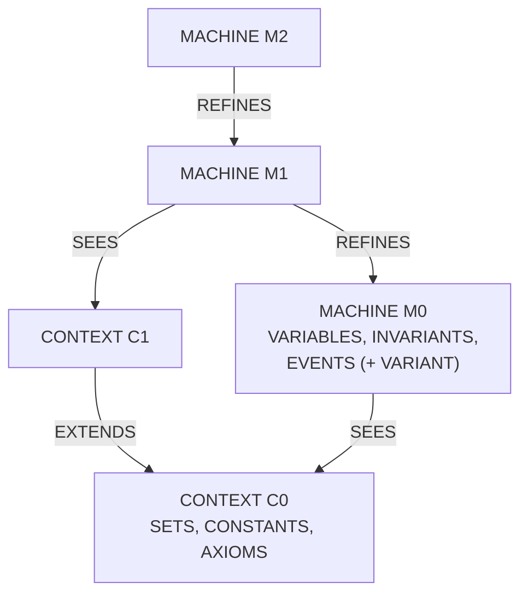

- **Contexte** : la partie statique (ensembles porteurs, constantes, axiomes, théorèmes).
- **Machine** : la partie dynamique. Un état, un invariant, et des **événements gardés**,
  `ANY x WHERE G(x, v) THEN v :| BA(x, v, v') END`.
- Le système exécute **n'importe quel événement dont la garde est vraie**, un pas à la fois.
  C'est exactement `Next ≜ E1 ∨ E2 ∨ ...` en TLA+.

### 4.2 La porte du train en Event-B (Rodin)

```
CONTEXT Porte_ctx
SETS ETAT
CONSTANTS ouverte fermee
AXIOMS
  axm1: partition(ETAT, {ouverte}, {fermee})
END

MACHINE Train0
SEES Porte_ctx
VARIABLES porte vitesse
INVARIANTS
  inv1: porte ∈ ETAT
  inv2: vitesse ∈ ℕ
  inv3: vitesse > 0 ⇒ porte = fermee
EVENTS
  INITIALISATION ≙
    THEN act1: porte ≔ fermee
         act2: vitesse ≔ 0
    END
  ouvrir ≙
    WHEN grd1: vitesse = 0
    THEN act1: porte ≔ ouverte
    END
  fermer ≙
    THEN act1: porte ≔ fermee
    END
  accelerer ≙
    ANY dv WHERE
      grd1: dv ∈ ℕ1
      grd2: porte = fermee
    THEN act1: vitesse ≔ vitesse + dv
    END
  freiner ≙
    ANY dv WHERE
      grd1: dv ∈ 1‥vitesse
    THEN act1: vitesse ≔ vitesse − dv
    END
END
```

**Raffinement** : on remplace `porte` par une **commande** `cmd` et un **capteur** `capteur`
(*la porte est-elle physiquement fermée ?*) :

```
MACHINE Train1
REFINES Train0
SEES Porte_ctx
VARIABLES cmd capteur vitesse
INVARIANTS
  inv1: cmd ∈ ETAT
  inv2: capteur ∈ BOOL
  inv3: capteur = TRUE ⇔ porte = fermee          // invariant de collage
VARIANT {cmd} ∩ {ouverte}                        // ensemble fini qui doit décroître strictement
EVENTS
  INITIALISATION ≙ THEN act1: cmd ≔ fermee  act2: capteur ≔ TRUE  act3: vitesse ≔ 0 END
  ouvrir REFINES ouvrir ≙
    WHEN grd1: vitesse = 0
    THEN act1: cmd ≔ ouverte
         act2: capteur ≔ FALSE
    END
  commander_fermeture ≙ CONVERGENT                // nouvel événement : raffine implicitement skip
    WHEN grd1: cmd = ouverte
    THEN act1: cmd ≔ fermee
    END
  fermer REFINES fermer ≙
    WHEN grd1: cmd = fermee                       // garde renforcée : autorisé
    THEN act1: capteur ≔ TRUE
    END
  accelerer REFINES accelerer ≙
    ANY dv WHERE
      grd1: dv ∈ ℕ1
      grd2: capteur = TRUE                        // implique porte = fermee via inv3
    THEN act1: vitesse ≔ vitesse + dv
    END
  freiner REFINES freiner ≙ ...                   // inchangé (EXTENDED)
END
```

### 4.3 Les obligations de preuve d'Event-B (noms Rodin)

| PO | Forme | Sens |
|---|---|---|
| `INV` | `A ∧ I ∧ G ⇒ I[BA]` | l'événement préserve l'invariant |
| `FIS` | `A ∧ I ∧ G ⇒ ∃v'·BA` | l'action est faisable |
| `GRD` | `A ∧ I ∧ J ∧ G_conc ⇒ G_abs` | renforcement de garde dans le raffinement |
| `SIM` | `... ∧ BA_conc ⇒ BA_abs[witness]` | simulation, avec des *witnesses* (`WITH`) pour les paramètres abstraits disparus |
| `VAR` / `NAT` / `FIN` | le variant décroît, et il est naturel ou fini | **convergence** des nouveaux événements, qui ne doivent pas « prendre la main » indéfiniment |
| `WD` | bonne définition | pas de `f(x)` hors du domaine, pas de division par zéro... |
| `DLF` (optionnelle) | `I ⇒ G1 ∨ ... ∨ Gn` | absence de blocage (*deadlock freedom*) |

### 4.4 B classique ou Event-B ?

| | B classique | Event-B |
|---|---|---|
| Cible | **Logiciel**, jusqu'au code | **Système**, avec son environnement |
| Unité de base | Opération appelée (`PRE`) | Événement spontané (garde) |
| Raffinement | Jusqu'au B0, puis génération de code | Ajout progressif de détails ; nouveaux événements (`skip`) |
| Substitutions | Riches (`CHOICE`, `SELECT`, `CASE`, `WHILE`...) | Seulement des actions avant/après, plus simples |
| Outils | Atelier B | Rodin, Atelier B, ProB |
| Usage chez ClearSy | Logiciel SIL4 (CBTC, portes palières, CSSP) | Analyse de sûreté système (NYCT, Octys), spécifications |

---

## 5. La CLEARSY Safety Platform (CSSP)

> **Source principale de cette section :** le *CSSP Programming Handbook*, publié par ClearSy sur
> GitHub ([CLEARSY/CSSP-Programming-Handbook](https://github.com/CLEARSY/CSSP-Programming-Handbook)),
> complété par les pages ClearSy et l'article de Lecomte et al. (arXiv:2005.10662).

La CSSP est un **automate programmable de sécurité (PLC), générique et certifiable SIL4**, issu du
projet **LCHIP** (*Low Cost High Integrity Platform*). Elle se programme **uniquement en B**. Toute la
difficulté de la sûreté (redondance, diversité, autotests) est **intégrée à la plateforme et hors de
portée du développeur**, qui n'écrit que la fonction métier, en B prouvé.

### 5.1 Le problème qu'elle résout

- **Un seul processeur ne suffit pas.** Un système SIL4 doit viser un taux de défaillance dangereuse
  de 10⁻⁷ à 10⁻⁹ par heure. Or un processeur seul a une fiabilité de l'ordre de 10⁻⁴ à 10⁻⁶ par heure.
  Il en faut donc au moins deux qui se surveillent.
- **La preuve B ne couvre pas tout.**

| Type d'erreur | Exemple | Ce qui protège |
|---|---|---|
| Spécification | on a spécifié le mauvais système | **rien d'automatique** : validation humaine et tests |
| Développement | le code ne respecte pas la spécification | **preuve B** |
| Programmation | division par zéro, débordement, tableau hors bornes | **preuve B** (obligations de bonne définition) |
| **Compilation** | le binaire ne correspond pas au source | **diversité** : deux chaînes de compilation |
| **Exécution** | RAM corrompue, instruction fausse, compteur ordinal corrompu | **redondance** et comparaisons |
| Matériel d'E/S | une sortie ne répond plus à la commande | **relecture** des sorties |

Traditionnellement, couvrir les trois dernières lignes exige des experts rares en matériel et en
sûreté. L'idée de la CSSP est de le faire **une fois pour toutes dans la plateforme**.

### 5.2 Le modèle de programmation : une boucle fixe

```
boucle infinie :
   1. lire les entrées        ← imposé, non modifiable
   2. calculer                ← LA SEULE PARTIE QUE TU ÉCRIS (opération user_logic)
   3. écrire les sorties      ← imposé, non modifiable
```

L'IDE (Atelier B, avec un type de projet « CSSP ») génère le squelette du projet. Le développeur ne
modifie que `user_logic`, et ajoute des composants si besoin. Voici l'exemple réel du handbook, qui
calcule `O1 = I1 ∧ I2 ∧ I3` et `O2 = ¬O1` :

```b
user_logic =
BEGIN
    VAR i1_, i2_, i3_ IN
        i1_ : (i1_ : uint8_t);   i2_ : (i2_ : uint8_t);   i3_ : (i3_ : uint8_t);
        i1_ <-- get_I1;  i2_ <-- get_I2;  i3_ <-- get_I3;
        O1 := IO_OFF;
        IF i1_ = IO_ON THEN
            IF i2_ = IO_ON THEN
                IF i3_ = IO_ON THEN O1 := IO_ON END
            END
        END;
        IF O1 = IO_ON THEN O2 := IO_OFF ELSE O2 := IO_ON END
    END
END
```

- **Les `IF` sont imbriqués** : le compilateur B vers HEX n'accepte **qu'une condition par `IF`**.
  Les variables locales doivent être typées avant usage, et les opérateurs arithmétiques sont dédiés
  pour éviter les débordements. Le compilateur reste volontairement simple.
- **`O2 = ¬O1` est un idiome ferroviaire** : si les deux sorties sont à OFF, l'équipement est en
  panne ou n'est plus alimenté, ce qui est détectable de l'extérieur.
- **La spécification abstraite** de `user_logic` est ici volontairement vague (`O1 :: uint8_t`).
  Dans un vrai projet, on y écrit la relation entrée/sortie exigée, et la preuve montre que
  l'implémentation la respecte. Pour ce type d'application, la preuve est en grande partie automatique.

### 5.3 La chaîne de génération : un modèle, deux binaires

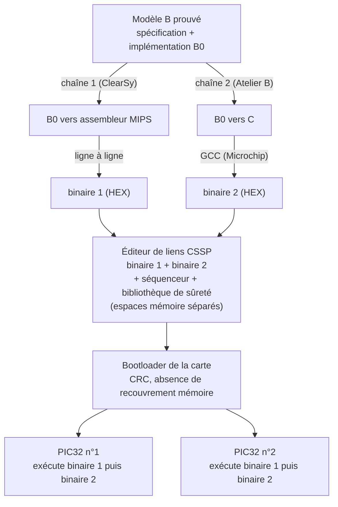

- **Pourquoi deux chaînes ?** Deux outils écrits avec des technologies différentes, par des équipes
  indépendantes, ont très peu de chances de produire **la même erreur au même endroit**. Une erreur
  de compilation devient donc une **divergence détectée** à l'exécution. *Mon interprétation, pas
  une citation :* c'est ce qui dispense de démontrer la correction de chaque compilateur.
- **Pourquoi passer par l'assembleur MIPS ?** La traduction de l'assembleur vers le HEX est faite
  ligne à ligne, ce qui facilite le débogage. Le compilateur B vers HEX a d'abord été développé pour
  des **portes palières de métro au Brésil**.
- **Les binaires diffèrent volontairement** : modèles mémoire différents, instructions neutres
  (`x := y + z + 1 - 1`)... Une perturbation matérielle n'affecte alors pas les deux programmes de la
  même façon.
- **La bibliothèque de sûreté** est écrite et prouvée en B une fois pour toutes. Les accès
  matériels de bas niveau sont des *machines de base* : spécifiées en B, mais implémentées à la main.

### 5.4 L'exécution : « 2oo2 matériel, 4oo4 logiciel »

Il y a **quatre instances** de la même fonction : deux binaires différents, sur chacun des deux
microcontrôleurs. **Toutes doivent être d'accord.**

| Fréquence | Vérification | Ce qu'elle détecte |
|---|---|---|
| **À chaque cycle** | Comparaison des **variables** de binaire₁ et binaire₂ sur le même microcontrôleur (par CRC) | Erreur de compilation, corruption de la RAM des données |
| En tâche de fond, sur des milliers de cycles | Comparaison de la **mémoire programme** | Corruption du code |
| **Au moins toutes les 50 ms** | Échange entre les deux microcontrôleurs, qui comparent leurs variables | Panne d'un microcontrôleur |
| Régulièrement | État **physique** des sorties comparé à l'état commandé | Sortie qui ne répond plus |
| En permanence | Une sortie n'est active que si **les deux** microcontrôleurs sont vivants : l'un fournit l'énergie, l'autre la commande | Microcontrôleur bloqué ou fou |
| En permanence | Entrées rendues **dynamiques** par l'ajout d'un signal en fréquence | Un court-circuit pris pour un « 1 » |

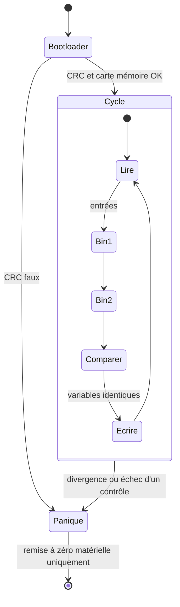

**Le mode panique, c'est le *fail-safe*.** Dès qu'**une seule** vérification échoue :
- toutes les sorties sont coupées (elles sont normalement ouvertes, donc sans énergie, le circuit est ouvert) ;
- la LED clignote ;
- la carte entre dans une boucle infinie qui ne fait rien ;
- seule une **remise à zéro matérielle** permet d'en sortir.

C'est le principe ferroviaire de l'**état sûr** : en cas de doute, on coupe. Un signal sans énergie
est au rouge, un frein sans énergie freine, une porte sans commande reste fermée.

### 5.5 Les versions

| Version | Usage | Différences |
|---|---|---|
| **Industrielle** | Projets réels. ClearSy annonce une certification SIL4 selon **EN 50126:2017, EN 50128:2011 et EN 50129:2018** | Version complète |
| **Kits éducatifs SK0 et SK1** | Enseignement, prototypage | 5 entrées/sorties (SK0) ou 28 (SK1), toutes booléennes. Il **manque** l'isolation galvanique entre les deux moitiés de carte, et les sorties pilotées par un signal sinusoïdal. **Ces kits ne sont pas utilisables en exploitation réelle** |

Côté matériel : des **PIC32**, d'environ 50 DMIPS selon le handbook (80 MIPS selon les plaquettes
commerciales). Le handbook précise que l'architecture de sûreté vaut pour **n'importe quel
processeur mono-cœur**, et qu'un portage vers un STM32 ne remettrait pas en cause la démonstration
de sûreté.

### 5.6 Regard critique

**Points forts :**
- Le développeur n'a **pas besoin d'être expert en sûreté**. Le coût de certification est mutualisé :
  la plateforme est certifiée une fois, et chaque application n'a à justifier que sa logique.
- **Un seul modèle B** produit les logiciels redondants. On évite d'avoir deux équipes qui codent
  deux fois la même chose, comme dans la diversité classique.

**Limites :**
- **La puissance de calcul est faible.** Chaque cycle exécute deux fois le programme, plus les
  contrôles. La plateforme vise donc le contrôle-commande booléen (portes, aiguillages, signaux,
  passages à niveau), pas le calcul intensif.
- **Elle détecte, elle ne tolère pas.** C'est du *fail-safe*, pas du *fail-operational* : une
  perturbation arrête le système jusqu'à la remise à zéro. Si la disponibilité compte, il faut
  redonder des cartes entières.
- **Le B0 accepté par le compilateur est restreint** : une condition par `IF`, des opérateurs dédiés,
  des variables locales à typer explicitement.
- **La validation de la spécification reste humaine.**
- Dans la version décrite par le handbook, il n'y a **que des entrées/sorties booléennes** ;
  l'analogique et le réseau étaient annoncés « pour le futur ». L'état actuel est **(à vérifier)**.

### 5.7 Le lien avec ton profil

C'est sans doute **le produit ClearSy le plus proche de ton expérience** :

| Élément de la CSSP | Ton expérience |
|---|---|
| Compilateur B0 → assembleur MIPS → HEX | Ton compilateur FPGA chez NanoXplore et ton *mini-compiler* ML vers x86-64 |
| Diversité logicielle contre les erreurs de compilation | Tes ROBDD pour la vérification d'équivalence : une **autre** façon d'avoir confiance dans un compilateur (la validation de traduction) |
| Carte double processeur, entrées dynamiques, sorties « énergie + commande » | VHDL/Verilog, SymbiYosys |
| Bibliothèque de sûreté prouvée en B | Lean 4 : prouver les invariants d'une bibliothèque de bas niveau |

**Questions intelligentes à poser en entretien :**
1. *« La diversité couvre les erreurs de compilation par détection. Avez-vous envisagé de la
   validation de traduction, ou un compilateur B0 prouvé, façon CompCert ? »*
2. *« Le compilateur B vers HEX n'accepte qu'une condition par `IF`. Est-ce une limite technique, ou
   un choix pour garder un compilateur simple à justifier ? »*
3. *« Où en est le portage vers d'autres microcontrôleurs, et vers des entrées/sorties analogiques et
   réseau ? »*

---

## 6. Le pont avec ton expérience

### Vue d'ensemble

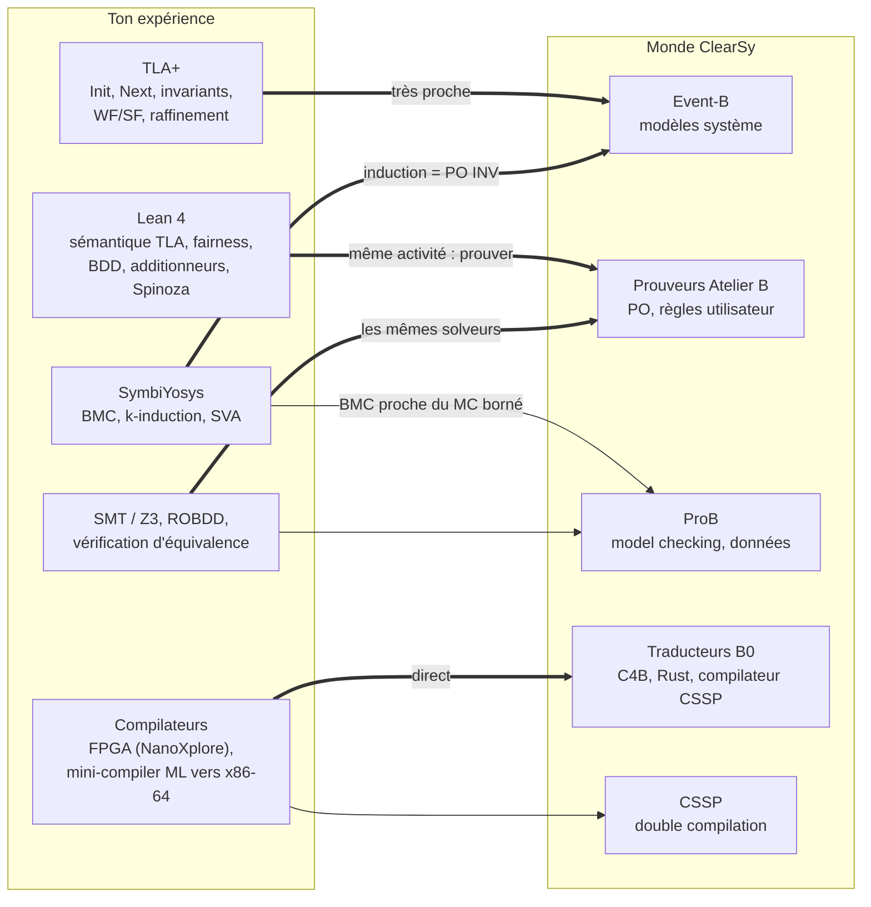

### 6.1 TLA+ et Event-B : cousins très proches

Le même système, en TLA+ :

```tla
---- MODULE Porte ----
EXTENDS Naturals
VARIABLES porte, vitesse
vars == <<porte, vitesse>>

Init      == porte = "fermee" /\ vitesse = 0
Ouvrir    == vitesse = 0 /\ porte' = "ouverte" /\ UNCHANGED vitesse
Fermer    == porte' = "fermee" /\ UNCHANGED vitesse
Accelerer == \E dv \in 1..10 : porte = "fermee" /\ vitesse' = vitesse + dv /\ UNCHANGED porte
Freiner   == \E dv \in 1..vitesse : vitesse' = vitesse - dv /\ UNCHANGED porte
Next      == Ouvrir \/ Fermer \/ Accelerer \/ Freiner

Spec      == Init /\ [][Next]_vars /\ WF_vars(Freiner)
Securite  == vitesse > 0 => porte = "fermee"
THEOREM Spec => []Securite
====
```

| Concept | TLA+ | Event-B | B classique |
|---|---|---|---|
| État | `VARIABLES` | `VARIABLES` | `VARIABLES` |
| Typage | invariant `TypeOK` (TLA+ non typé) | invariants `x ∈ S` (typé, vérifié) | idem |
| Initialisation | `Init` (prédicat) | événement `INITIALISATION` | `INITIALISATION` |
| Transition | action `A(v, v')` | événement gardé, `BA(v, v')` | opération (`PRE`) |
| Relation de transition | `Next ≜ ∨ Aᵢ` | disjonction implicite des événements | (appels de l'environnement) |
| Bégaiement | `[Next]_vars` | nouveaux événements qui raffinent `skip` | — |
| Sûreté | `Spec ⇒ □Inv` (via un invariant inductif) | PO `INV` | PO de préservation |
| Vivacité | `◇`, `↝`, **WF/SF** | **convergence** (variants), `DLF` ; pas de fairness native | — |
| Raffinement | `Impl ⇒ Spec` via un *refinement mapping* `v ↦ f(w)` | invariant de collage `J(v, w)` + witnesses | collage `J` |
| Vérification auto | TLC, Apalache (BMC SMT) | ProB | ProB |
| Preuve | TLAPS (Zenon, Isabelle, SMT) | prouveurs Rodin / Atelier B, SMT | Atelier B |
| Logique sous-jacente | ZF non typée + logique temporelle | théorie des ensembles typée, premier ordre | idem |

**Ce que tu sais déjà et qui sert directement :**

- **Invariant inductif.** Un `Inv` qui n'est pas inductif en TLAPS se *renforce*. En Event-B, une PO
  `INV` qui ne passe pas signale exactement la même chose : il faut **ajouter un invariant**. C'est
  80 % du travail quotidien.
- **Raffinement et bégaiement.** Ta formalisation `StutterClosed`/`SafetySpec`
  (`output/temporal-logic/TemporalLogic/MachineClosure.lean`) est la sémantique exacte du fait que
  les nouveaux événements d'un raffinement Event-B « raffinent `skip` ».
- **Fairness.** Tu as prouvé en Lean `SF ⇒ WF` et les caractérisations `WF ⇔ □◇¬ENABLED ∨ □◇⟨A⟩`
  (`Fairness.lean`). Event-B **n'a pas** de fairness native. La vivacité y passe par des variants
  (convergence), par l'absence de blocage, ou par des extensions de recherche (Hoang & Abrial, *Reasoning
  about liveness properties in Event-B*). C'est une **différence de fond**, et un bon sujet de
  discussion où tu as une vraie compétence à apporter.
- **Machine closure.** Ton théorème sur la *machine closure* (`IsMachineClosed`) explique pourquoi
  TLA+ sépare sûreté (`Init ∧ □[Next]`) et vivacité (WF/SF). Event-B évite le problème en ne
  spécifiant presque que la sûreté.

### 6.2 Lean 4 et le prouveur de B

| | Lean 4 | Atelier B / Rodin |
|---|---|---|
| Fondement | Théorie des types dépendants (CIC), noyau minimal | Théorie des ensembles typée + premier ordre |
| Ce qu'on prouve | Des théorèmes arbitraires (maths, sémantique) | Des **PO générées** à partir du modèle |
| Automatisation | `simp`, `omega`, `decide`, `aesop`, `grind` | Forte et spécialisée (ML, PP, SMT) : la plupart des PO passent seules |
| Confiance | Petit noyau, termes de preuve vérifiables | Prouveurs + **règles utilisateur** (à valider) ; qualification T2 |
| Usage | Recherche, sémantique, bibliothèques | Industrie certifiée |

L'**exemple exécuté** [`clearsy-exemples/MiniB.lean`](clearsy-exemples/MiniB.lean) encode un mini-B,
dans le style de ton `SafetySpec` :

```lean
structure Machine (σ : Type) where
  inv  : σ → Prop
  init : σ → Prop
  ops  : List (σ → σ → Prop)

/-- Les deux familles de PO de B : initialisation et préservation. -/
structure Correct {σ : Type} (M : Machine σ) : Prop where
  po_init : ∀ s, M.init s → M.inv s
  po_ops  : ∀ op ∈ M.ops, ∀ s s', M.inv s → op s s' → M.inv s'

/-- Si les PO sont prouvées, l'invariant tient sur toute exécution. -/
theorem inv_toujours {σ : Type} (M : Machine σ) (h : Correct M) (b : Nat → σ)
    (h0 : M.init (b 0)) (hpas : ∀ n, ∃ op ∈ M.ops, op (b n) (b (n+1))) :
    ∀ n, M.inv (b n) := by
  intro n
  induction n with
  | zero => exact h.po_init _ h0
  | succ k ih =>
    obtain ⟨op, hop, hs⟩ := hpas k
    exact h.po_ops op hop _ _ ih hs

-- PO de `ouvrir` prouvée, et version sans garde réfutée par un contre-exemple :
theorem po_ouvrir : ∀ s s', inv s → ouvrir s s' → inv s' := by
  rintro s s' _ ⟨h0, rfl⟩ hv
  simp at hv
  omega

theorem po_ouvrir_bug_fausse : ¬ ∀ s s', inv s → ouvrir_bug s s' → inv s' := by
  intro h
  have := h ⟨.fermee, 1⟩ ⟨.ouverte, 1⟩ (fun _ => rfl) rfl (by decide)
  cases this
```

À dire en entretien : *« Atelier B génère `po_init` et `po_ops` pour moi et prouve `inv_toujours`
une fois pour toutes au niveau de la méthode. Mon travail se réduit à faire passer les PO. »*

**Pistes où Lean apporterait de la valeur chez ClearSy** (ce sont des pistes, pas des projets que je sais exister) :
vérifier formellement des **règles utilisateur** d'Atelier B, mécaniser la sémantique de B0 ou du
traducteur C (une validation de traduction façon CompCert), ou faire une contre-vérification
indépendante des PO (une *seconde chaîne*, comme l'article sur ProB *Who watches the watchers*).

### 6.3 SymbiYosys et B : l'induction des deux côtés

Les deux approches prouvent un invariant par **induction**. Elles diffèrent par **qui fournit l'invariant**
et par **ce qui est automatisé**.

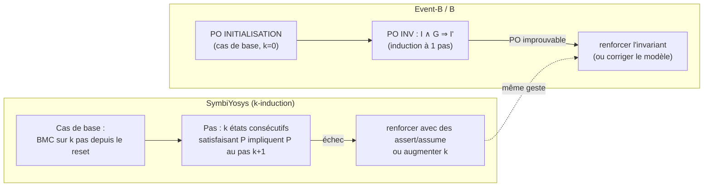

L'exemple exécuté [`clearsy-exemples/porte.sv`](clearsy-exemples/porte.sv) +
[`porte.sby`](clearsy-exemples/porte.sby) code **la même porte en RTL**, avec la même assertion
`!(vitesse != 0 && ouverte)` :

```verilog
if (cmd_ouvrir && vitesse == 0) ouverte <= 1'b1;
else if (cmd_fermer)            ouverte <= 1'b0;
if (!ouverte && acc != 0 && vitesse <= 8'd255 - acc)   // version naïve
    vitesse <= vitesse + acc;
```

Résultats obtenus (Yosys/SBY, moteur `smtbmc z3`) :

| Tâche | Résultat | Explication |
|---|---|---|
| `bmc` (profondeur 10) | **FAIL au pas 2** | Au même cycle, `cmd_ouvrir` (avec `vitesse = 0`) **et** `acc ≠ 0` (porte encore fermée) : au cycle suivant, la porte est ouverte et le train roule |
| `prove` (k-induction) | **FAIL** (cas de base) | le même contre-exemple |
| `prove_corrige` | **PASS**, induction réussie | on interdit l'accélération pendant le cycle où l'ouverture est acceptée |

**La leçon est importante, et objective.** Le modèle B ou Event-B est **juste** et le RTL est **faux**.
En B, les opérations sont **atomiques et entrelacées** : on ne peut pas ouvrir et accélérer « en même temps ».
En RTL, tout ce qui se trouve dans un cycle est **simultané**. Prouver le modèle ne suffit donc pas :
il faut aussi prouver que le modèle d'exécution (entrelacement) correspond à la cible. C'est
exactement le rôle du raffinement jusqu'au B0 séquentiel, puis de la double compilation sur la CSSP.
**Ta double culture RTL et méthodes déductives** est précisément ce qui permet de voir ce genre d'écart.

**Correspondances utiles :**

| SymbiYosys | B / Event-B |
|---|---|
| `assert` | invariant (`INVARIANT`, `inv_i`) |
| `assume` | `PROPERTIES` / `AXIOMS`, gardes, préconditions |
| `mode bmc` | ProB (model checking borné et explicite) |
| `mode prove` (k-induction) | PO `INV` (induction à 1 pas) + invariants renforcés |
| `cover` | les *scénarios* d'animation de ProB |
| contre-exemple VCD | contre-exemple ProB |
| assertions auxiliaires pour la k-induction | invariants auxiliaires (souvent la majorité du travail) |

> **Objectivité.** SymbiYosys **n'apparaît pas** dans ton CV. Si tu veux le mettre en avant, prépare
> un exemple concret, chiffré si possible : quel bloc, combien d'assertions, quel bug trouvé, quel `k`.
> Sinon l'interlocuteur ne pourra pas le créditer.

### 6.4 Compilateurs, SMT, ROBDD : tes atouts les plus différenciants

| Ton expérience | Équivalent chez ClearSy |
|---|---|
| Compilateur FPGA (NanoXplore) : IR, passes, *pattern matching* DSP, graphes et hypergraphes | Traducteurs **B0 vers C, Ada, Rust** ; compilateur **B0 vers HEX** de la CSSP ; analyse de projets B (dépendances, *Project Checker*) |
| *mini-compiler* ML vers x86-64 | Même chaîne : AST, typage, génération de code. B0 est un petit langage impératif |
| SMT (Z3) en vérification formelle | Atelier B intègre **Z3, CVC5, Alt-Ergo** pour prouver les PO. Tu sais encoder un problème en SMT et lire un *unknown* |
| ROBDD, vérification d'équivalence | Validation de traduction ; validation de **données** (ProB, problèmes SAT/CSP sur les plans de voie) |
| CTU-Solver (CP/IP en Rust), MiniZinc, ROADEF | ProB est un **solveur de contraintes** sur la théorie des ensembles. La validation de données est un problème CSP |
| Rust | Atelier B **génère désormais du Rust** |
| Airbus, Liebherr Aerospace | Culture des normes (DO-178C), qui transpose à EN 50128 / EN 50716 et IEC 61508 |
| VHDL/Verilog | Le matériel de la CSSP ; la sûreté des E/S |

### 6.5 Forces et lacunes

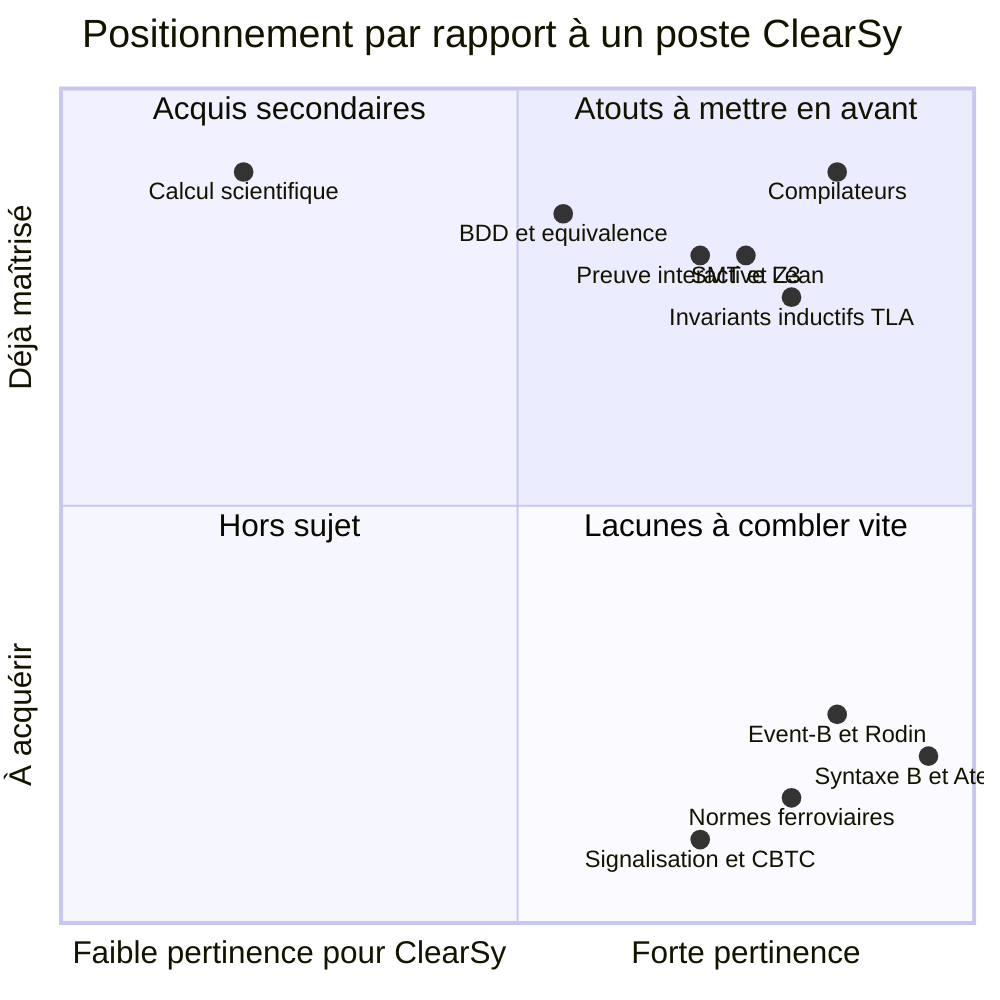

*(Positions qualitatives, issues de mon jugement à partir de ton CV : ce ne sont pas des mesures.)*

---

## 7. Regard critique : limites et lacunes

### Sur la méthode B et Event-B (à connaître, sans les dénigrer)

- **Le coût de la preuve interactive.** Les PO non automatiques peuvent représenter des semaines
  d'ingénieur. Le nombre de PO croît vite avec la taille du modèle.
- **Les règles utilisateur** sont un point de fragilité : une règle fausse rend tout prouvable.
- **La validation de la spécification reste humaine.** Prouver n'aide pas si l'invariant ne capture
  pas la bonne exigence. On le voit sur l'exemple RTL : un modèle peut être juste et ne pas
  correspondre à la cible d'exécution.
- **B0 est restrictif** : pas d'allocation dynamique, de pointeurs ni de récursion libre. C'est voulu
  pour le SIL4, mais cela limite les usages hors du contrôle-commande.
- **La vivacité est peu traitée** en Event-B, comparé à TLA+ et à son WF/SF.
- **L'écosystème est restreint** : la communauté est surtout française et ferroviaire, il y a peu de
  bibliothèques, et l'outillage moderne (CI, éditeurs, diff de preuves) est en retard sur Lean ou
  Rust. Le recrutement dépend d'une niche.
- **La concurrence et les alternatives** : SCADE (Ansys), SPARK/Ada (AdaCore), Frama-C, et
  model checking + tests. B garde l'avantage du **raffinement jusqu'au code** et d'un **historique
  industriel de 30 ans**.

### Sur ton profil (pour préparer les questions difficiles)

| Lacune probable | Comment la traiter |
|---|---|
| Pas de pratique d'Atelier B ni de Rodin | Faire le plan de 2 semaines ci-dessous, et apporter un petit projet B prouvé |
| Pas d'expérience ferroviaire ni de normes EN 50128 / 50716 | Lire les grandes lignes : SIL, cycle en V, classes d'outils T1, T2, T3, rôle de l'ISA |
| SymbiYosys absent du CV | Préparer un exemple concret |
| Expérience récente surtout « outil » | Montrer de l'intérêt pour la modélisation de **systèmes clients**, pas seulement pour l'outillage |

---

## 8. Préparation à l'entretien

### 8.1 Questions probables, avec des pistes de réponse

1. **« Quelle différence entre une précondition et une garde ? »**
   `PRE` : obligation de l'appelant, comportement non spécifié si elle est violée (B classique).
   Garde : l'événement est impossible si elle est fausse (Event-B, `SELECT`, TLA+). Voir la [§2.3](#23-les-substitutions-généralisées-et-la-plus-faible-précondition).
2. **« Que prouve-t-on lors d'un raffinement ? »**
   `I ∧ J ∧ Q ⇒ [S']¬[S]¬J` : chaque pas concret est simulé par un pas abstrait qui préserve le collage.
   En Event-B : `GRD` + `SIM` + `INV`, et `VAR` pour les nouveaux événements.
3. **« Une PO ne passe pas. Que faites-vous ? »**
   (a) La lire comme une **question**. (b) Chercher un contre-exemple avec ProB. (c) S'il n'y en a pas,
   l'invariant est trop faible : le renforcer. (d) En dernier recours, preuve interactive. (e) Règle
   utilisateur seulement si elle est **justifiée**. Fais le parallèle avec la k-induction de SBY.
4. **« Pourquoi la double compilation sur la CSSP ? »**
   Une erreur d'un compilateur devient une divergence détectée à l'exécution : deux chaînes diverses
   (B0 → MIPS → HEX chez ClearSy, B0 → C → GCC), quatre instances comparées à chaque cycle, et un
   passage en mode panique (sorties coupées) au moindre désaccord. La redondance des deux
   microcontrôleurs couvre en plus les fautes matérielles aléatoires. Voir la [§5](#5-la-clearsy-safety-platform-cssp).
5. **« TLA+ ou Event-B pour modéliser un CBTC ? »**
   Les deux conviennent pour la sûreté. Event-B apporte le raffinement prouvé et l'outillage
   qualifiable apprécié du ferroviaire. TLA+ est meilleur pour la vivacité, la fairness et les
   algorithmes distribués (TLC, Apalache). Le choix dépend du livrable de certification.
6. **« Qu'apporteriez-vous à ClearSy ? »**
   Des compilateurs (traducteurs B0, CSSP), le SMT (intégration des solveurs dans Atelier B), la preuve
   interactive (Lean), et la double culture RTL et déductive (voir l'exemple de la porte).
7. **Exercice au tableau probable :** écrire une petite machine (pile bornée, compteur, feu,
   réservation de sièges), donner ses PO, puis proposer un raffinement.

### 8.2 Mini-exercices pour s'entraîner

1. **Pile bornée** : `MACHINE Pile(MAX)`, `pile : seq(NAT) & size(pile) <= MAX`, opérations
   `empiler(x)` (`PRE size(pile) < MAX`) et `depiler`. Écris les PO à la main.
2. **Raffinement de données** : raffine la pile par un tableau `tab : 1..MAX --> NAT` et un indice
   `top : 0..MAX`. Collage : `pile = (1..top) <| tab`.
3. **Event-B** : un feu à deux voies (deux feux qui ne sont jamais verts ensemble), puis un raffinement avec l'orange.
4. **Réfutation** : retire une garde, fais tourner ProB, explique le contre-exemple.
5. **Pont** : réécris l'exercice 3 en TLA+, ajoute `WF` et prouve (ou model-checke) une propriété `↝`.
   Explique ce qu'Event-B ne peut pas exprimer directement.

### 8.3 Plan d'apprentissage sur deux semaines

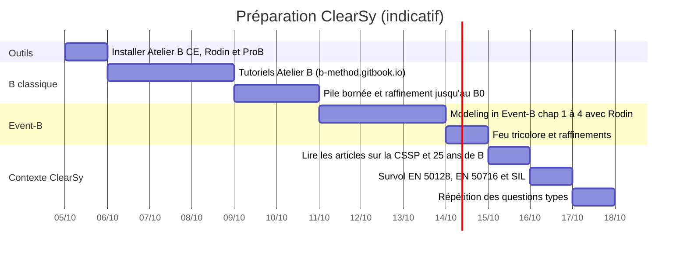

### 8.4 Ressources

- J.-R. Abrial, ***The B-Book: Assigning Programs to Meanings***, Cambridge University Press, 1996.
- J.-R. Abrial, ***Modeling in Event-B: System and Software Engineering***, Cambridge University Press, 2010.
- Atelier B, téléchargement et tutoriels : <https://www.atelierb.eu/en/atelier-b-support-maintenance/download-atelier-b/>, <https://b-method.gitbook.io/training-resources-for-atelier-b>
- Rodin : <https://www.event-b.org> ; ProB : <https://prob.hhu.de>
- T. Lecomte et al., *The CLEARSY Safety Platform: 5 Years of Research, Development and Deployment*, arXiv:2005.10662.
- ClearSy, *CSSP Programming Handbook* (avec des projets d'exemple en B) : <https://github.com/CLEARSY/CSSP-Programming-Handbook>
- T. Lecomte, *Programming the CLEARSY Safety Platform with B*, ABZ 2020.
- T. Lecomte et al., *Applying a Formal Method in Industry: a 25-Year Trajectory*, arXiv:2005.07190.
- T. Lecomte, *The Bourgeois Gentleman, Engineering and Formal Methods*, arXiv:2005.08309.
- P. Behm et al., *Météor: A Successful Application of B in a Large Project*, FM'99.

---

## 9. Sources

Recherches web effectuées pour ce document, le 1er octobre 2026 :

- ClearSy, historique : <https://www.clearsy.com/en/clearsy/historical-background/>
- ClearSy, brochure générale (2020) : <https://www.clearsy.com/wp-content/uploads/2021/07/CLEARSY-General-brochure-nov-2020-6-pages.pdf>
- ClearSy, Atelier B : <https://www.clearsy.com/outils/atelier-b/>, <https://www.clearsy.com/en/tools/atelier-b/>
- ClearSy, méthode B : <https://www.clearsy.com/thematiques/methode-b/>
- ClearSy, CSSP : <https://www.clearsy.com/en/tools/clearsy-safety-platform/>, <https://www.clearsy.com/en/components/calculateur-clearsy-safety-plateform/>
- ClearSy, validation de données : <https://www.clearsy.com/en/railway/data-validation-in-the-railways/>, <https://www.clearsy.com/en/offers/clearsy-data-manager/>
- ClearSy, Atelier B T2 Certified Edition : <https://www.clearsy.com/en/the-tools/atelier-b-t2-certified-edition-now-available-for-purchase/>
- Atelier B Community Edition 24.04 : <https://www.atelierb.eu/en/atelier-b-community-edition-24-04-available/>
- Lecomte et al., CSSP : <https://arxiv.org/abs/2005.10662>
- **CSSP Programming Handbook** (ClearSy, source primaire de la §5) : <https://github.com/CLEARSY/CSSP-Programming-Handbook>
- ClearSy, calculateur certifié SIL4 : <https://www.clearsy.com/en/railway/clearsys-safe-calculator-certified-sil4/>
- *Programming the CSSP with B* (ABZ 2020) : <https://pmc.ncbi.nlm.nih.gov/articles/PMC7242050/>
- *Applying a Formal Method in Industry: a 25-Year Trajectory* : <https://arxiv.org/pdf/2005.07190>
- *The First Twenty-Five Years of Industrial Use of the B-Method* : <https://dl.acm.org/doi/10.1007/978-3-030-58298-2_8>
- *Formal Proofs for the NYCT Line 7 (Flushing) Modernization Project* : <https://www.researchgate.net/publication/262163970>
- *Formally Checking Large Data Sets in the Railways* : <https://arxiv.org/pdf/1210.6815>
- *A History of Formal Methods in Railways* (ACM) : <https://dl.acm.org/doi/10.1145/3802545>

Dans le dépôt :

- `output/temporal-logic/TemporalLogic/{Defs,Fairness,MachineClosure}.lean` : sémantique TLA, WF/SF, *machine closure*.
- `inputs/temporal-logic/verification_formelle_bmc_k_induction.pdf` : BMC et k-induction.
- `notes/clearsy-exemples/` : `MiniB.lean` (vérifié avec Lean 4.29.0-rc1), `porte.sv` + `porte.sby` (vérifiés avec Yosys/SBY + Z3).
